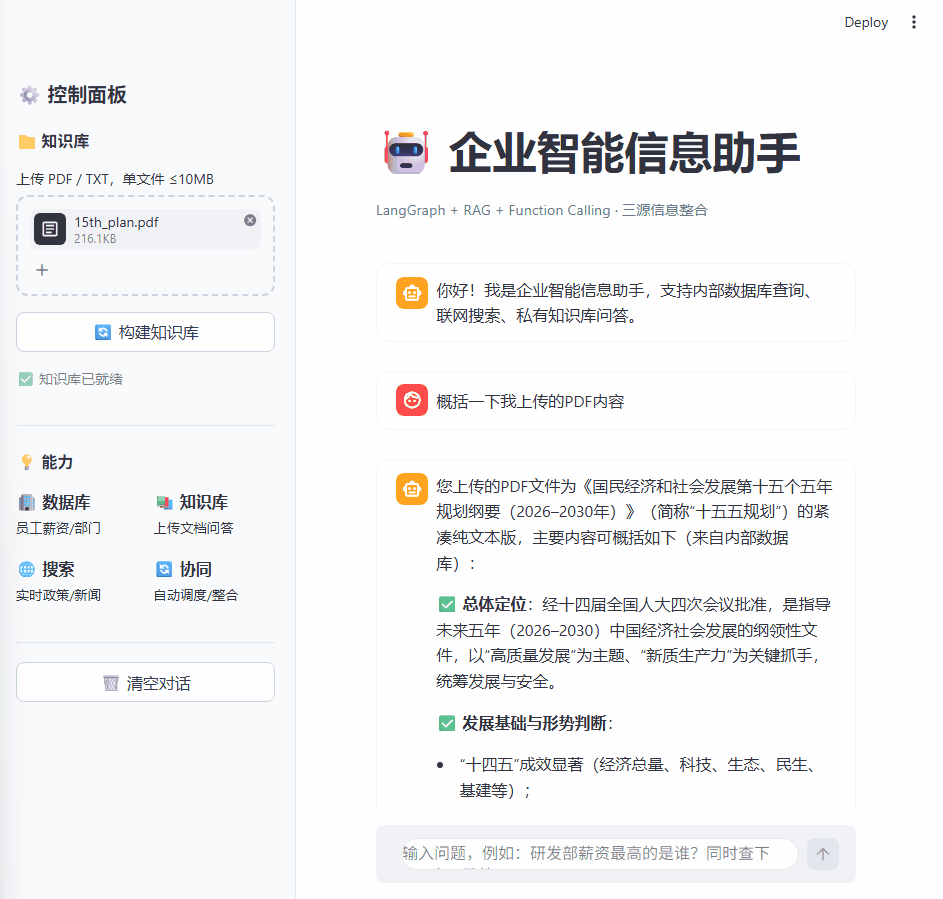

# 企业智能信息助手 · 多工具协同Agent系统

基于 LangGraph + RAG + Function Calling 构建的企业级三源信息整合系统。Agent 自主识别用户意图，协同调度私有知识库、内部数据库与联网搜索三类工具，输出带溯源信息的精准回答，内置完整的安全校验、容错降级与可视化交互能力。

## 🖥️ 演示


## ✨ 核心特性
- **三源信息协同**：打通私有文档知识库、业务数据库、公网实时资讯，支持单工具与多工具混合调用
- **智能意图路由**：基于大模型推理自动匹配最优信息源，无需人工指定工具类型
- **高可靠 RAG 问答**：递归字符分块 + 置信度拒答双重机制，答案可溯源至原始文档片段
- **企业级安全防护**：SQL 白名单校验、文件格式白名单、会话级数据隔离，敏感数据不出域
- **多级容错降级**：自动重试、关键词扩展检索、结果兜底三级机制，系统静默失败率 < 1%
- **可视化交互界面**：基于 Streamlit 构建，支持多轮对话、工具调用详情全链路展示

## 🛠️ 技术栈
| 分类 | 技术选型 |
|------|----------|
| AI 核心框架 | LangGraph、LangChain、Function Calling、Prompt Engineering |
| 向量与数据 | FAISS 向量数据库、HuggingFace Embeddings、结构化数据库 |
| 大模型与工具 | 阿里云百炼（通义千问）、Tavily Search API |
| 交互与部署 | Streamlit、Python、Docker |
| 工程能力 | 全链路日志、会话状态管理、异常重试机制 |

## 🏗️ 整体架构
系统基于 LangGraph 构建三节点状态机工作流，形成完整的决策-执行-生成闭环：
1. **决策节点**：接收用户问题，分析意图并决策调用工具类型，支持单工具与多工具并行调度
2. **执行节点**：按决策结果执行对应工具，返回结构化结果；调用失败自动触发容错重试
3. **生成节点**：整合多工具返回结果，基于上下文生成带溯源信息的最终回答

## 🚀 快速开始
### 环境要求
- Python 3.10+
- 阿里云百炼 API Key（或其他 OpenAI 兼容大模型服务）
- Tavily Search API Key（联网搜索功能）

### 安装与启动
1. 克隆仓库
```bash
git clone https://github.com/OWO-zh/ai-qa-agent.git
cd ai-qa-agent
```
2. 安装与依赖
```bash
pip install -r requirements.txt
```
3. 配置环境变量
项目根目录创建 `.env` 文件，填入对应密钥：
```
LLM_API_KEY=你的大模型API密钥
TAVILY_API_KEY=你的Tavily搜索密钥
DB_PATH=本地数据库路径
```
1. 启动Web界面
```bash
set HF_ENDPOINT=https://hf-mirror.com
streamlit run app.py
启动后浏览器自动访问 http://localhost:8501 即可使用。
```

## 📁 项目目录结构
```plaintext
ai-qa-agent/
├── app.py                # Streamlit 交互界面入口
├── agent.py              # Agent 核心逻辑与状态机定义
├── tools/                # 工具实现模块
│   ├── rag_tool.py       # 知识库检索工具
│   ├── sql_tool.py       # 数据库查询工具
│   └── search_tool.py    # 联网搜索工具
├── config/               # 配置与常量定义
├── utils/                # 日志、校验、通用工具函数
├── requirements.txt      # 项目依赖
└── README.md
```
## 📊 效果指标
- **工具调度准确率**：90%+
- **复杂查询平均工具调用次数**：< 2 次
- **RAG 知识范围内回答准确率**：90%+
- **无匹配内容拒答准确率**：95%+
- **系统静默失败率**：< 1%

## 🛤️ 后续规划

- 接入更多工具类型（计算器、代码执行、图表生成）
- 支持多用户权限体系与工具访问范围管控
- 接入 Redis 实现会话状态持久化
- 增加 Prompt 注入防护与输出内容审核

## 📖 详细文档
参阅 [技术文档](docs.md) 了解架构设计、模块细节和安全策略。

## 📞 联系方式

- 邮箱：[YASK2025@163.com](mailto:YASK2025@163.com)

## 📝 许可证
MIT License