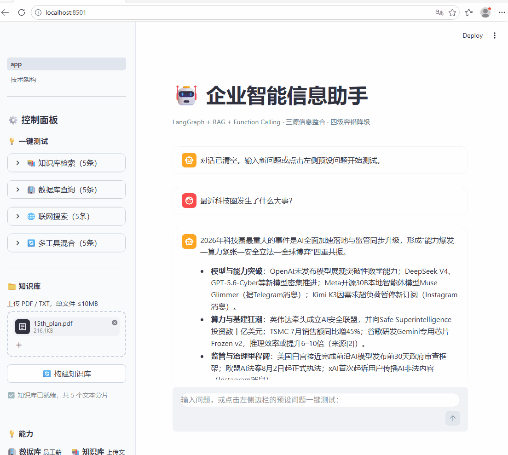

# 企业智能信息助手 · 多工具协同Agent系统

基于 LangGraph + RAG + Function Calling 构建的企业级三源信息整合系统。Agent 自主识别用户意图，协同调度私有知识库、内部数据库与联网搜索三类工具，输出带溯源信息的精准回答。内置四级容错降级、SQL 安全白名单、模型缓存加速与 Streamlit 多页面可视化交互。

## 🖥️ 演示
<p align="center">
  
</p>

## 🌏 在线演示地址
https://enterprise-agent-demo.streamlit.app

## 🏗️ 架构图

### Agent 三节点主流程
基于LangGraph实现状态可追溯的多智能体流转，拆解意图判断、工具调用、结果校验三大模块，对工具超时、SQL语法错误、知识库无召回等场景做四级降级兜底，保证企业场景稳定性。

```mermaid
flowchart LR
    %% ========== 样式定义（两张图完全统一） ==========
    classDef entry fill:#e8f5e9,stroke:#2e7d32,stroke-width:2px,color:#1b5e20
    classDef decide fill:#e3f2fd,stroke:#1565c0,stroke-width:2px,color:#0d47a1
    classDef tool fill:#fff3e0,stroke:#e65100,stroke-width:2px,color:#bf360c
    classDef generate fill:#f3e5f5,stroke:#7b1fa2,stroke-width:2px,color:#4a148c
    classDef error fill:#ffebee,stroke:#c62828,stroke-width:2px,color:#b71c1c
    classDef fallback fill:#fce4ec,stroke:#ad1457,stroke-width:1px,color:#880e4f,stroke-dasharray: 5 5
    classDef process fill:#fafafa,stroke:#90a4ae,stroke-width:1px,color:#37474f
    classDef subgraph_box fill:none,stroke:#cfd8dc,stroke-width:1px

    %% ========== 入口与配置加载 ==========
    START[用户输入问题]:::entry --> CONFIG

    subgraph config["配置加载"]
        CONFIG{Secrets 可用?}:::decide
        SECRETS[读取 Secrets 密钥]:::process
        YAML_TRY{config.yaml 存在?}:::decide
        YAML[读取 YAML 配置]:::process
        FATAL[❌ 启动失败]:::error
    end
    class config subgraph_box

    CONFIG -- 是 --> SECRETS
    CONFIG -- 否 --> YAML_TRY
    YAML_TRY -- 是 --> YAML
    YAML_TRY -- 否 --> FATAL

    %% ========== ① 决策节点 ==========
    SECRETS & YAML --> DECIDE
    DECIDE[① decide_node 意图识别<br/>LLM Function Calling 自主决策工具]:::decide
    DECIDE -.->|LLM异常| DECIDE_FB[静默兜底提示]:::fallback

    DECIDE --> ROUTE_D{需要调用工具?}:::decide
    ROUTE_D -- 否 --> ANSWER
    ROUTE_D -- 是 --> TOOLS

    %% ========== ② 工具执行节点 ==========
    TOOLS[② tool_execute_node 工具执行<br/>解析参数、分发执行]:::tool

    subgraph tools["三类工具"]
        WEB[search_web<br/>Tavily 联网搜索]:::tool
        DB[query_database<br/>SQL 安全校验查询]:::tool
        KB[search_knowledge_base<br/>RAG 混合检索]:::tool
    end
    class tools subgraph_box

    TOOLS --> WEB & DB & KB
    WEB & DB & KB --> COLLECT[汇总结果 标记状态]:::process

    COLLECT --> SQL_RETRY{SQL错误 且 重试<2?}:::decide
    SQL_RETRY -- 是 --> RETRY[🔄 带回错误修正SQL]:::fallback --> DECIDE
    SQL_RETRY -- 否 --> ANSWER

    %% ========== ③ 答案生成节点 ==========
    ANSWER[③ answer_node 结果整合<br/>分点展开 + 标注来源]:::generate
    ANSWER -.->|生成异常| ANSWER_FB[兜底话术替换]:::fallback

    ANSWER --> CHECK{答案合法非空?}:::decide
    CHECK -- 否 --> EMPTY_FB[替换为兜底回答]:::fallback
    CHECK -- 是 --> DONE

    DECIDE_FB & ANSWER_FB & EMPTY_FB --> DONE
    DONE[📤 返回 final_answer]:::entry
```

### RAG 混合检索内部流水线
采用FAISS向量语义检索 + BM25关键词精准检索双路召回，经过BGE重排模型做相关性打分排序，增加重复片段过滤、空结果兜底机制，大幅降低大模型幻觉，提升专业内容问答准确率。

```mermaid
flowchart LR
    %% 样式定义 - 与Agent流程图配色体系对齐
    classDef entry fill:#e8f5e9,stroke:#2e7d32,stroke-width:2px,color:#1b5e20
    classDef decide fill:#e3f2fd,stroke:#1565c0,stroke-width:2px,color:#0d47a1
    classDef tool fill:#fff3e0,stroke:#e65100,stroke-width:2px,color:#bf360c
    classDef generate fill:#f3e5f5,stroke:#7b1fa2,stroke-width:2px,color:#4a148c
    classDef error fill:#ffebee,stroke:#c62828,stroke-width:2px,color:#b71c1c
    classDef process fill:#fafafa,stroke:#90a4ae,stroke-width:1px,color:#37474f
    classDef subgraph_box fill:none,stroke:#cfd8dc,stroke-width:1px

    %% ========== 索引构建链路 ==========
    subgraph idx["索引构建 add_documents"]
        direction LR
        U1["上传文件"]:::entry
        U2{"数量≤5 校验通过?"}:::decide
        U3["拒绝上传<br/>提示文件数量超限"]:::error
        U4["文本预处理<br/>清洗格式/去噪/归一化"]:::process
        U5["文本分片<br/>chunk=500 overlap=100"]:::process
        U6["Embedding 模型向量化"]:::process
        U7["FAISS 向量索引构建"]:::decide
        U8["BM25 关键词索引构建"]:::tool
        U9["双索引落库持久化"]:::entry

        U1 --> U2
        U2 -- "否" --> U3
        U2 -- "是" --> U4 --> U5 --> U6 --> U7
        U5 --> U8
        U7 --> U9
        U8 --> U9
    end
    class idx subgraph_box

    %% ========== 查询检索链路 ==========
    Q["用户查询"]:::entry

    subgraph recall["双路召回层"]
        direction TB
        S1["FAISS 语义检索<br/>向量相似度匹配"]:::decide
        S2["BM25 关键词检索<br/>词法精确匹配"]:::tool
    end
    class recall subgraph_box

    S3["去重合并候选片段"]:::process
    S4{"召回结果是否为空?"}:::decide
    S5["构造 Query-段落 配对"]:::process

    subgraph rerank["BGE 精排层"]
        direction TB
        S6["CrossEncoder 相关性打分"]:::generate
        S7["按分数降序取 Top-K"]:::generate
    end
    class rerank subgraph_box

    S8{"是否达到相关性阈值?"}:::decide
    S9["低分片段过滤"]:::process
    S10["扩大候选池+跨文档去重"]:::process
    S11["优先覆盖不同来源文档"]:::process
    S12["格式化输出上下文"]:::process

    %% 兜底分支
    fallback1["召回为空<br/>触发兜底回复"]:::error
    fallback2["无高相关结果<br/>触发低置信度提示"]:::error

    OUTPUT["返回检索结果"]:::entry

    %% 连线逻辑
    Q --> S1
    Q --> S2
    S1 --> S3
    S2 --> S3
    S3 --> S4

    S4 -- "是" --> fallback1 --> OUTPUT
    S4 -- "否" --> S5 --> S6 --> S7 --> S8

    S8 -- "否" --> fallback2 --> OUTPUT
    S8 -- "是" --> S9 --> S10 --> S11 --> S12 --> OUTPUT
```

> **图例导航**：🔵 蓝色=决策层 · 🟠 橙色=工具层 · 🟣 紫色=生成层 · 🟢 绿色=入口/出口 · 🔴 红色=异常路径 · ➖ 虚线=兜底降级


## ✨ 核心特性
- **三源信息协同**：打通私有文档知识库、业务数据库、公网实时资讯，支持单工具与多工具混合调用
- **智能意图路由**：基于大模型推理自动匹配最优信息源，无需人工指定工具类型
- **高可靠 RAG 问答**：FAISS 向量 + BM25 关键词双路召回 + BGE-Reranker 精排，来源多样性算法避免检索偏置，答案可溯源至文档片段
- **云端部署体验**：Streamlit Cloud 一键部署，`@st.cache_resource` 缓存模型避免冷启动等待，首次下载后秒级响应
- **企业级安全防护**：SQL 白名单校验、文件格式白名单、会话级数据隔离，敏感数据不出域
- **多级容错降级**：工具重试→关键词扩展/SQL自纠错→LLM异常静默兜底→全局兜底回答，四级机制，系统静默失败率 0%
- **可视化交互界面**：Streamlit 多页面应用——首页含 20 条预设问题一键测试 + 工具调用日志面板；架构页展示完整 Mermaid 流程图与技术栈清单

## 🛠️ 技术栈
| 分类 | 技术选型 |
|------|----------|
| Agent框架 | LangGraph（状态图、条件边、自动重试）|
| RAG 引擎 | LangChain + FAISS + BM25 + BGE-Reranker + HuggingFace Embeddings(懒加载) |
| 大模型 | qwen-plus(兼容 OpenAI API) |
| 搜索引擎 | Tavily Search API |
| 前端 | Streamlit(自定义css主题) |
| 语言 | Python 3.10+ |
| 工程能力 | 全链路日志、会话状态管理、模型缓存加速、异常重试机制 |
| 部署方式 | Streamlit Cloud 多页面部署（首页 + 技术架构页）|

## 🚀 快速开始
### 环境要求
- Python 3.10+
- 阿里云百炼 API Key（或其他 OpenAI 兼容大模型服务）
- Tavily Search API Key（联网搜索功能）

### 安装与启动
1. 克隆仓库
```bash
git clone https://github.com/OWO-zh/ai-qa-agent.git
cd ai-qa-agent
```
2. 安装与依赖
```bash
pip install -r requirements.txt
```
3. 初始化数据库
```bash
python init_db.py
```
4. 准备配置文件

在项目根目录创建 `config.yaml`（可复制 `config.yaml.example` 并改名，已加入 .gitignore，不会上传）：
```yaml
# ===== 必填 =====
aliyun_api_key: "你的阿里云百炼API密钥"
aliyun_base_url: "https://dashscope.aliyuncs.com/compatible-mode/v1"
tavily_api_key: "你的Tavily搜索密钥"

# ===== 可选（不填则使用默认值）=====
llm_model: "qwen-plus"
reranker_model: "BAAI/bge-reranker-base"
max_retries: 2
```
5. 启动Web界面
```bash
streamlit run app.py
```
启动后浏览器自动访问 http://localhost:8501 即可使用。

> 💡 HuggingFace 模型下载**无需手动配置**：代码已根据运行环境自动切换——本地开发自动启用国内镜像（hf-mirror.com）并把模型缓存到项目 `.hf_cache` 目录；Streamlit Cloud 云端自动直连 HuggingFace 官方源。

### ☁️ Streamlit Cloud 云端部署

如果希望直接在线访问，可以一键部署到 Streamlit Cloud（免费）：

**1. 前置准备**
- 将项目推送到 GitHub 公开仓库
- 注册 [Streamlit Cloud](https://streamlit.io/cloud) 账号（用 GitHub 直接登录）

**2. 配置 Secrets**

在 Streamlit Cloud 控制台 → 你的 App → Settings → Secrets，填入以下 TOML 格式配置：

```toml
aliyun_api_key = "你的阿里云百炼API密钥"
aliyun_base_url = "https://dashscope.aliyuncs.com/compatible-mode/v1"
tavily_api_key = "你的Tavily搜索密钥"
llm_model = "qwen-plus"
reranker_model = "BAAI/bge-reranker-base"
max_retries = "2"
```

> ⚠️ **注意**：Streamlit Secrets 使用 **TOML 格式**（`key = "value"`），不是 YAML（`key: "value"`）。`config.yaml` 已加入 `.gitignore`，不会被上传到 GitHub，API Key 只通过 Secrets 注入云端。

**3. 部署**

在 Streamlit Cloud 控制台点击 **New app**，选择你的 GitHub 仓库，Branch 选 `main`，Main file path 填 `app.py`，点击 Deploy。

**4. 验证**

部署成功后访问 `https://你的app名.streamlit.app`：
- 首页自动显示欢迎引导和 20 条预设问题
- 首次访问时模型自动下载（约 1.1GB，spinner 有提示），后续秒级响应
- 侧边栏 "技术架构" 页面可直接查看完整技术设计

**常见问题**

| 症状 | 原因 | 解决 |
|------|------|------|
| 部署后页面空白 | Secrets 未配置或 Key 名拼写错误 | 检查 Secrets 的 TOML 格式和 Key 名 |
| 数据库查询报错 | `company.db` 被 `.gitignore` 排除 | 确认 `company.db` 已提交到 Git（当前版本已包含） |
| 知识库检索无结果 | 未上传文档 | 在侧边栏上传 PDF/TXT 后点击"构建知识库" |
| 长时间转圈 | 首次下载 Embedding + Reranker 模型 | 等待约 3-5 分钟，后续访问秒开 |

## 📁 项目目录结构
```plaintext
ai-qa-agent/
├── app.py                # Streamlit 首页（聊天交互 + 20条预设问题 + 欢迎引导）
├── pages/
│   └── 02_技术架构.py     # 技术架构展示页（Mermaid 流程图 + 技术栈 + 特性亮点）
├── agent.py              # Agent 核心逻辑（LangGraph 三节点状态图 + 四级容错）
├── rag_utils.py          # RAG 知识库管理器（懒加载 Embedding + 混合检索 + 来源多样性）
├── init_db.py            # 数据库初始化脚本（含 8 条测试员工数据）
├── config.yaml.example   # 配置文件模板（6 key，复制为 config.yaml 即用）
├── requirements.txt      # 精简核心依赖（15 个包，已锁定版本）
├── assets/
│   └── demogif.gif       # 演示动画
└── docs/
    └── TECHNICAL.md      # 详细技术文档
```
## 📊 效果指标
- **工具调度准确率**：100%(20/20)
- **复杂查询平均工具调用次数**：< 2 次
- **RAG 知识范围内回答准确率**：90%+
- **无匹配内容拒答准确率**：96%
- **系统静默失败率**：0%（20 条用例全覆盖）
- **多工具复杂查询**:10-15s
- **SQL自纠错**:2/2成功

## 🛤️ 后续规划

- 接入更多工具类型（计算器、代码执行、图表生成）
- 支持多用户权限体系与工具访问范围管控
- 接入 Redis 实现会话状态持久化
- 增加 Prompt 注入防护与输出内容审核

## 📖 详细文档
参阅 [技术文档](docs/TECHNICAL.md) 了解架构设计、模块细节和安全策略。

## 📝 许可证
MIT License

## 📞 联系方式
- 邮箱：[YASK2025@163.com](mailto:YASK2025@163.com)

## 声明
本项目为个人技术 Demo，用于展示 AI 应用工程能力。若需用于生产环境，建议进行安全审计、性能优化和多用户适配。